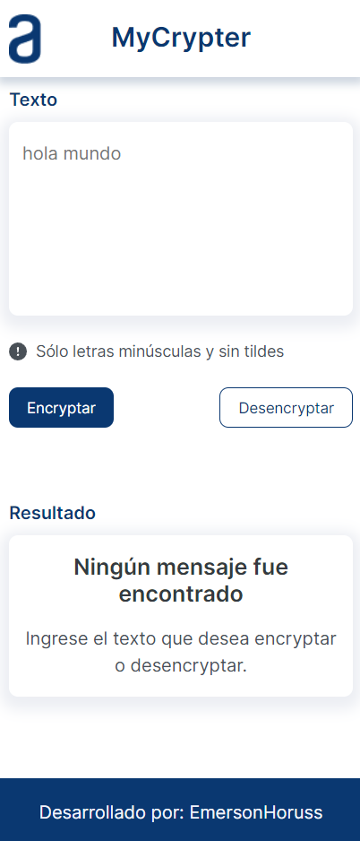

# MyCrypt
MyCrypt is a project required for Alura and Oracle as challenge, it is the first challenge. The main porpose is to encrypt or decrypt any message or text you think, it is very useful for enconding or decoding. This uses the next algorithm: "a" by "ai", "e" by "enter", "i" by "imes", "o" by "ober" and "u" by "ufat". Just programmed to works with lowercase letters without accents.

It is deployed here: https://emersonhoruss.github.io/mycrypter.github.io/

# Features
## Functional Requeriments
- Encrypt
- Decrypt
- Copy

## No Functional Requirements
- Responsive design
- Consistent design
- Html5
- Css3
- JavaScript

# Interfaces
## Mobile

## Tablet

## Desktop

Thanks Alura & Oracle
#challengeonecodificador5
